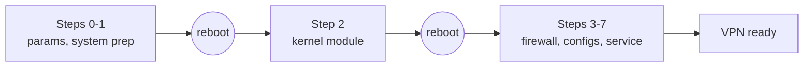

# Install AmneziaWG VPN server on Ubuntu / Debian VPS

A step-by-step guide for deploying an AmneziaWG 2.0 VPN server on a clean Ubuntu or Debian VPS over SSH. Single bash command, no Docker, no web panel. Aimed at headless setups where you want a working DPI-resistant VPN with the lowest possible footprint on a cheap VPS.

> The official [Amnezia VPN](https://amnezia.org/) app deploys the server side for you in Docker. This guide takes a different route on purpose: AmneziaWG as a kernel module, no Docker overhead, and the whole server tuned and hardened for a single-purpose VPN. See [how it differs](https://bivlked.github.io/amneziawg-installer/compare/).

## TL;DR

- One command, MIT-licensed, fully self-hosted, no third-party dependencies at runtime.
- Works on Ubuntu 24.04 LTS, Ubuntu 26.04 and Debian 13 (trixie). Ubuntu 25.10 and Debian 12 (bookworm) work too, but both are past regular support; details below.
- Built for cheap VPS budgets: $3 to $5 a month, 1 vCPU, 512 MB RAM minimum (1 GB recommended), 2 GB disk minimum (3+ GB recommended).
- Both x86_64 (amd64) and ARM64 (aarch64), with prebuilt kernel modules covering Raspberry Pi 4/5, Ubuntu 24.04/25.10 ARM64, and Debian 12/13 ARM64 (Hetzner CAX, Oracle Ampere A1, AWS Graviton all run on these stock kernels). Ubuntu 26.04 ARM64 builds the module from source via DKMS.
- DPI bypass for Russia (ТСПУ), Iran, China, school and corporate firewalls.
- Survives kernel upgrades automatically via DKMS auto-repair (since v5.12.0). On ARM with a prebuilt module there is no DKMS: after a kernel change, run the installer again.
- Ubuntu 25.10 and 26.04 PPA fallback to noble is automatic since v5.13.0.

## Choosing a VPS

A VPN server is mostly idle CPU and steady network. Three picks I keep coming back to:

- **Hetzner CAX11 / CAX21** (ARM Ampere, EU). About €4 / month for 2 vCPU and 4 GB RAM. Wide bandwidth, EU jurisdiction, prebuilt ARM kernel module is published for this exact platform. The catch: Hetzner subnets are widely blacklisted by Russian carriers (TSPU, Rostelecom, MTS), so do not use Hetzner if you are routing Russian mobile traffic into the tunnel. Pick a non-Russia-blacklisted host for that case.
- **Oracle Cloud Always Free (ARM Ampere A1)**. 4 vCPU and 24 GB RAM in the free tier, no expiry, multiple regions. Reliable but capacity-limited (Oracle releases A1 quotas in waves).
- **Generic budget VPS** (Vultr, RackNerd, your local provider). Pick anything with 1 GB RAM, root SSH access, and not on a known-bad subnet for your audience. ARM is fine where prebuilts apply, otherwise amd64 with DKMS-built kernel module works the same way.

Country matters mostly for latency and jurisdiction. ARM versus amd64 has no real performance difference for a personal-scale VPN.

**Check that your host gives you an emergency console, and that it works.** It is the simplest way back in if SSH stops answering after a reboot or because of a firewall rule. Without one, recovery means provider support, a snapshot rollback or a reinstall.

## OS choice

- **Ubuntu 24.04 LTS** is the best-tested platform. Default pick if you have no other preference.
- **Ubuntu 26.04** works since v5.13.0. The PPA codename remaps to `noble` automatically when the running codename PPA is unreachable (404 or network failure). Resilient against do-release-upgrade from 24.04.
- ⚠️ **Ubuntu 25.10** (questing) works the same way, through the same remap to `noble`. But Ubuntu itself stopped supporting it on 2026-07-01, and being an interim release it gets no extended support either: no security updates of any kind are published for it. There is nothing to gain by choosing it for a new server, so take 24.04 LTS or 26.04 instead. If a box is already on 25.10, the installer handles it.
- **Debian 13** (trixie) is fully supported, with the codename mapped to `noble`.
- ⚠️ **Debian 12** (bookworm) is just as fully supported by the installer, with the codename mapped to `focal`. Debian itself ended regular support on 2026-07-11; security updates continue through Debian LTS until 2028-06-30, so the system is still patched, though no longer by the main team. Prefer Debian 13 for a new server. Note: upstream shipped AmneziaWG 3.0 in late July 2026. On kernels older than 6.7, which includes Debian 12 (kernel 6.1), the installer deliberately stays on AmneziaWG 2.0: it builds a pinned 2.0 module from source instead of taking 3.0 from the PPA, so the install keeps working (since v5.23.0); see [ADVANCED](ADVANCED.en.md#debian-support-adv) for the details.
- Use a minimal install. The script assumes the box is single-purpose and will strip modemmanager, snapd, cloud-init leftovers and similar to free resources.
- Avoid custom kernels (XanMod, Liquorix, Zen) on first install. DKMS compiles against the running kernel headers, but custom kernels can shift internal structs and trip a runtime panic. If you must, file a repro upstream rather than guessing.

## One-command install

Connect as root (or as a sudo-capable user and prepend `sudo`). The installer usually detects the SSH port automatically and allows it in UFW. If SSH runs on a non-standard port or autodetection is unavailable, pass `--ssh-port=YOUR_PORT` to the installer (comma-separated for several ports). As an extra conservative safeguard you can allow the port in UFW **before** running the installer:

```bash
sudo ufw allow <your-ssh-port>/tcp
```

Then:

```bash
wget -O install_amneziawg_en.sh https://github.com/bivlked/amneziawg-installer/releases/latest/download/install_amneziawg_en.sh
chmod +x install_amneziawg_en.sh
sudo bash ./install_amneziawg_en.sh
```

The script walks through OS detection, base packages, PPA setup, kernel module install (DKMS or ARM prebuilt), UFW firewall, sysctl hardening, Fail2Ban, AmneziaWG service start, and default client config generation. Expect two reboots and 15 to 25 minutes of wall-clock time, mostly bound by `apt` and the kernel module build.

The script is **idempotent and resume-safe**: after each reboot, run the same command again and it picks up from where it left off. State lives in `/root/awg/setup_state`. Two reboots are part of the normal flow:



Two questions are easy to miss. At the start the script lists the packages it would remove (snapd, unattended-upgrades and others) and asks first; answer `n` or pass `--keep-packages` to keep them. If UFW is not on yet, the third run asks "Enable UFW? [y/N]": answer `y`, because pressing Enter leaves the server without a firewall.

For a non-interactive run pass `--yes`: `sudo bash ./install_amneziawg_en.sh --yes`. The routing mode then falls back to the default, the packages are removed and UFW is enabled without asking.

**Routing modes** (what goes into the tunnel):

| Flag | Mode | When to pick it |
|---|---|---|
| `--route-all` | "All traffic" (`0.0.0.0/0`) | the default, the full-tunnel form clients expect |
| `--route-amnezia` | "Amnezia", a subnet list | when the private networks must stay out of the tunnel |
| `--route-custom=NETS` | "Custom" | when the subnet list is your own |

⚠️ The "Amnezia" mode sends the same public IPv4 into the tunnel as the full tunnel does: the only difference is the private networks, which stay outside. But the Amnezia app reads such a list as split routing already configured on the server and disables its own split-tunneling page, and a Linux client can loop its routes on it. That is why `--route-all` is the default. The details: [ADVANCED, AllowedIPs](ADVANCED.en.md#allowedips-adv). Common flags: `--port=39743` (any port 1-65535), `--subnet=10.9.9.1/24`, `--disallow-ipv6`, `--allow-ipv6-tunnel` (dual-stack IPv6 inside the tunnel), `--mobile` (mobile obfuscation preset plus port 443/udp in one flag; an explicit `--port` wins), `--isolation=on|off` (client-to-client isolation, on by default), `--endpoint=<public-IP>` (required when the server's public IP differs from its interface IP, typical on Oracle Cloud, GCP, or any NAT'd cloud setup). Full CLI: `--help` or [ADVANCED.en.md](ADVANCED.en.md#install-cli-adv).

## First-time client setup

The default install creates two clients (`my_phone`, `my_laptop`) so you can connect immediately. To add more:

```bash
sudo bash /root/awg/manage_amneziawg.sh add my_iphone
```

All client files land in `/root/awg/`. There are four of them, and they are not interchangeable:

| File | What it is for |
|---|---|
| `<name>.conf` | text config: AmneziaWG desktop clients, Linux `awg-quick`, routers |
| `<name>.png` | QR code of that same `.conf`, for AmneziaWG clients with QR import (a plain WireGuard client cannot import it) |
| `<name>.vpnuri` | the `vpn://` link for the Amnezia VPN app |
| `<name>.vpnuri.png` | QR code of the `vpn://` link, to import into the Amnezia VPN app with one scan |

**The two QR codes are easy to mix up.** `<name>.png` holds the config text, `<name>.vpnuri.png` holds the `vpn://` link. The Amnezia VPN app expects `<name>.vpnuri.png`; do not scan `<name>.png` in it. More: [ADVANCED, import via vpn://](ADVANCED.en.md#vpnuri-adv).

The installer does not print a QR code in the terminal; it saves the files. Copy them to your computer by running `scp` **on your own computer, not in the SSH session on the server** (PowerShell works on Windows):

```bash
scp root@SERVER_IP:/root/awg/my_iphone.conf .
scp root@SERVER_IP:/root/awg/my_iphone.vpnuri.png .
```

With a non-standard SSH port, `scp` takes it as `-P` (capital P):

```bash
scp -P YOUR_SSH_PORT root@SERVER_IP:/root/awg/my_iphone.conf .
```

Where to import:

- **Amnezia VPN app** (Windows, macOS, Linux, Android, iOS): "Add VPN", then "Scan QR code" for `<name>.vpnuri.png`, or "Paste from clipboard" with the link from `sudo cat /root/awg/my_iphone.vpnuri`.
- **AmneziaWG client for Windows**: import `<name>.conf`.
- **Linux**: put `<name>.conf` in place and bring it up with `awg-quick up`.

Verify the handshake from the server side with `sudo awg show awg0` after the client connects. The `latest handshake` line should refresh every minute. If you need PresharedKey for Shadowrocket on iOS or macOS, add the `--psk` flag during `manage add`.

You can drive the server from scripts too: since v5.21.0 the management commands take `--json` and reply with a single JSON object even when they fail, so a cron job or a bot can parse stdout without guesswork (the process exit code stays the source of truth). Add `--yes` for unattended runs, and set `AWG_STRICT_CONFIRM=1` if you want commands like `remove` to refuse when `--yes` is missing rather than quietly go ahead:

```bash
sudo bash /root/awg/manage_amneziawg.sh add phone --json --yes
# {"command":"add","ok":true,"added":1,"failed":0,"applied":true,"results":[{"name":"phone","status":"created","conf":"/root/awg/phone.conf","qr":"/root/awg/phone.png","vpnuri":"/root/awg/phone.vpnuri","expires_at":null}]}
```

Per-command output formats and the compatibility promise: [ADVANCED.en.md JSON interface](ADVANCED.en.md#json-api-adv).

## What next

- Add or remove people: `add <name>`, `remove <name>`, `list`, `stats`.
- Time-limited access: `add guest --expires=7d`.
- Reissue a lost config: `regen <name>` (the keys stay the same). If a config leaked, revoke it instead: `remove <name>`, then `add <name>` and hand out the new file.
- Back up before experiments: `backup`, and `restore` to go back.
- Check server health: `check`.

All of them run as `sudo bash /root/awg/manage_amneziawg.sh <command>`. Common next steps: [two-server cascade](CASCADE.en.md), [Russian sites through WARP](WARP-RU.en.md).

## Update flow

Updating to a newer installer release on a server that already has a supported version running:

```bash
wget -O install_amneziawg_en.sh https://github.com/bivlked/amneziawg-installer/releases/latest/download/install_amneziawg_en.sh
sudo bash ./install_amneziawg_en.sh --force
```

Set aside a few minutes for this. A reinstall walks the state machine from the top, so the box reboots twice, once after the system-update step and once after the kernel-module step, and you run the same command again after each reboot. Step 1 is replayed in full along the way: package cleanup, sysctl tuning, swap and BBR. The tunnel is down across those reboots, but nothing that clients hold is touched.

The `--force` flag (or `AWG_FORCE_REINSTALL=1`) is required when reinstalling over an already-running AmneziaWG service, so an accidental re-run on a healthy box does not destroy state. First-time installs do not need it. Server keys, peer list, and obfuscation parameters survive a reinstall. Since v5.21.0 the script pair is protected against drift: update one half and forget the other, and the scripts stop with the exact commands to fetch the missing piece, instead of throwing strange errors halfway through.

That is what keeps an update invisible to your users: config files and QR codes handed out earlier stay valid, and existing clients are preserved rather than recreated, the default `my_phone` and `my_laptop` included. One exception is worth remembering. Passing `--mobile`, `--preset`, `--jc`, `--jmin` or `--jmax` regenerates the whole `Jc`/`S`/`H`/`I1` set, while `--port` (as well as `--mobile`, which sets 443) changes the port. Either way every config issued before that stops connecting until you re-issue it with `sudo bash /root/awg/manage_amneziawg.sh regen` and hand it out again. `--endpoint` changes the address only in configs issued afterwards: the old ones keep the previous address and work as long as it still reaches the server, and they get the new one after `regen`. Leave those flags off when you are only updating. And if all you want is the newer management commands, `--force` is not needed at all: replacing the two scripts on the server is enough, and the installer only has to be re-run when the installer itself changed.

A normal `apt-get upgrade` will pull a new kernel from time to time. For DKMS-based installs (typical for amd64 and most ARM64 deployments without a prebuilt for the new kernel), `amneziawg-ensure-module` rebuilds the module transparently at the next boot. Check its log with `journalctl -u amneziawg-ensure-module.service -b` or read the rolling apt-hook log at `/var/log/amneziawg-ensure-module.log`. Manual recovery if all three safety nets miss: `sudo bash /root/awg/manage_amneziawg.sh repair-module` reinstalls headers, rebuilds DKMS, and restarts the service. ARM users running an ARM prebuilt should rerun the installer after a kernel upgrade so it picks a fresh prebuilt or falls back to DKMS.

## Uninstall

🔴 **The irreversible part first.** Uninstalling wipes `/root/awg/` entirely, and with it the server keys and every client config. Clients you handed files to stop connecting. If you may need the server later, make a copy **before** uninstalling and take it off the machine: run `sudo bash /root/awg/manage_amneziawg.sh backup` on the server, then `scp root@SERVER_ADDRESS:/root/awg/backups/*.tar.gz .` on your own computer. The uninstaller also offers a backup and makes one by default, but it can be declined or fail (the uninstall then continues), and it stays on the same server.

If the server runs the cascade or WARP, remove them first, following their own guides: [cascade](CASCADE.en.md#uninstall), [WARP](WARP-RU.en.md#uninstall).

Then uninstall:

```bash
sudo bash ./install_amneziawg_en.sh --uninstall
```

What `--uninstall` does:
- stops and disables `awg-quick@awg0`, unloads the module, and removes the `amneziawg-ensure-module` unit, hook and log;
- purges `amneziawg-dkms`, `amneziawg-tools` and `qrencode`, plus `fail2ban` only if the installer added it;
- removes the PPA and its key, `/etc/apt/apt.conf.d/99-amneziawg-lock-timeout`, `/etc/amnezia/`, `/etc/modules-load.d/amneziawg.conf`, its sysctl files, `/etc/cron.d/awg-expiry`, its Fail2Ban jail, the DKMS registration and `/root/awg/`, including the backups in `/root/awg/backups/`;
- in UFW removes the VPN port rule and the `awg0` forwarding rule; it turns UFW off only if the installer turned it on.

What stays:
- the uninstaller's archive `/root/awg_uninstall_backup_<date>.tar.gz` with every server and client key, and the log `/root/awg_uninstall.log`: archives accumulate, one per uninstall, so if you no longer need the server, copy the archive to your own machine and delete it from the server;
- the dependencies: `dkms`, `build-essential`, `dpkg-dev`, kernel headers, `wireguard-tools`, `ufw`, plus `git`, `gcc-13` and `python3-systemd` if they were installed;
- on ARM with a prebuilt module, the module package `amneziawg-kmod-*` itself;
- `/swapfile` and its line in `/etc/fstab`;
- packages removed during the install, which you have to reinstall by hand (`sudo apt install unattended-upgrades` and so on);
- the SSH rule in UFW if UFW was active before the install, and rules you added yourself;
- the sysctl values, until the next reboot.

Re-installing later starts from a clean slate.

## Troubleshooting

- **PPA 404 on Ubuntu 25.10 or 26.04.** Automatic fallback to noble since v5.13.0. If you are still on v5.12.x, upgrade the installer.
- **DKMS build fails on stale kernel headers** (typical after `do-release-upgrade` 24.04 to 25.10). v5.13.0 detects stale headers (kernel version differs from the running kernel) and installs gcc-13 as a fallback compiler so DKMS autoinstall succeeds across the version mismatch. If DKMS still fails, `sudo bash /root/awg/manage_amneziawg.sh repair-module` forces a rebuild.
- **Mobile carrier unstable or only connects on the third attempt.** On a new server, install with `--mobile` - it enables the mobile obfuscation preset and moves the port to 443/udp in one flag (carriers often drop unfamiliar UDP ports; an explicit `--port` wins if you pass both). On a running server that is a `--force --mobile` reinstall, after which every client config has to be reissued with `regen`; if the handshake never completes at all, read [the walkthrough](ADVANCED.en.md#no-hs-mobile-adv) first. Tested carriers (Russia): Yota (Moscow), Tele2 (Moscow), Tattelecom / Letai (Tatarstan), Beeline (default preset). Tele2 (Krasnoyarsk) needed `I1 = <r 48>` in May 2026, and Megafon (regional networks) needed I1 removed. Full per-carrier table and the underlying Jc / Jmin / Jmax mechanics are in [ADVANCED.en.md FAQ](ADVANCED.en.md#faq-advanced-adv).
- **Handshake completes but no packets flow.** Almost always the AllowedIPs gotcha on a custom split-tunnel config. Cover the server subnet too, not just the destinations you want. See [ADVANCED.en.md AllowedIPs](ADVANCED.en.md#allowedips-adv).
- **iPhone does not connect over cellular.** MTU issue. The installer sets `MTU = 1280` by default since v5.7.4; older configs need the line added manually. See [MTU and Mobile Clients](ADVANCED.en.md#mtu-mobile-adv).
- **ARM prebuilt unavailable for your kernel.** The installer falls back to DKMS automatically since v5.12.1. If both fail, file an issue with `sudo bash ./install_amneziawg_en.sh --diagnostic` output.
- **Nothing answers at all, not even SSH or ping.** That is not the VPN. Check the address itself, ideally from another network: if the whole address is unreachable, no obfuscation setting will help.

## Where to ask

- **Bug reports**: [GitHub Issues](https://github.com/bivlked/amneziawg-installer/issues).
- **Usage questions, deployment quirks**: [GitHub Discussions](https://github.com/bivlked/amneziawg-installer/discussions).
- **Feature requests**: vote on [Roadmap #79](https://github.com/bivlked/amneziawg-installer/issues/79) with a thumbs-up.

## Related reading

- [INSTALL_VPS.ru.md](INSTALL_VPS.ru.md) - the same guide in Russian.
- [CASCADE.en.md](CASCADE.en.md) - two-server cascade: Russian traffic direct, the rest abroad.
- [WARP-RU.en.md](WARP-RU.en.md) - Russian sites through Cloudflare WARP on the same server.
- [Hetzner Community: Making a website accessible from restricted regions](https://community.hetzner.com/tutorials/making-website-accessible-from-restricted-regions) - Hetzner tutorial that references this installer.
- [Pinggy: Top 5 Best Self-Hosted VPNs in 2026](https://pinggy.io/blog/top_5_best_self_hosted_vpns/) - third-party listing.
- [VPN Status (RU): AmneziaWG catalog](https://vpnstatus.site/protocols/amneziawg) - Russian-language directory of AmneziaWG server-side options.
- [LowEndTalk Tutorial #217191](https://lowendtalk.com/discussion/217191) - the short version of this guide, with reader Q&A.
- [README.en.md](README.en.md) - project overview, full feature list, FAQ, and the comparison with similar tools.
- [ADVANCED.en.md](ADVANCED.en.md) - full FAQ, mobile carrier presets, AWG 2.0 parameter reference, troubleshooting deep-dive.
