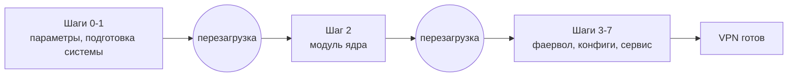

# Установка VPN-сервера AmneziaWG на VPS с Ubuntu или Debian

Пошаговое руководство: как за один вечер поднять на чистом VPS свой VPN-сервер AmneziaWG и подключить к нему телефон и ноутбук. Одна команда по SSH, без Docker, без веб-панели. Рассчитано на обычный дешёвый сервер без графики, где нужен рабочий VPN с обходом DPI и минимальным расходом ресурсов.

> Официальное приложение [Amnezia VPN](https://amnezia.org/) умеет разворачивать серверную часть само, в Docker. Этот путь другой и выбран сознательно: AmneziaWG модулем ядра, без накладных расходов Docker, а сам сервер настроен и укреплён под одну задачу. [Чем отличается](https://bivlked.github.io/amneziawg-installer/ru/compare/).

## Коротко

- Одна команда, лицензия MIT, всё на вашем сервере, никаких сторонних сервисов при работе.
- Ubuntu 24.04 LTS, Ubuntu 26.04, Debian 13 (trixie). Ubuntu 25.10 и Debian 12 (bookworm) тоже работают, но обычная поддержка у обеих уже закончилась - подробности ниже.
- Хватает дешёвого VPS: 1 vCPU, 512 МБ ОЗУ минимум (комфортно от 1 ГБ), 2 ГБ диска минимум (лучше 3+).
- x86_64 (amd64) и ARM64 (aarch64). Для ARM есть готовые модули ядра: Raspberry Pi 4/5, Ubuntu 24.04/25.10 ARM64, Debian 12/13 ARM64 (на этих же ядрах работают Hetzner CAX, Oracle Ampere A1, AWS Graviton).
- Обфускация против DPI: рассчитана на ТСПУ в России, а также на фильтры в Иране, Китае, школах и офисах. Гарантий это не даёт: результат зависит от конкретной сети и подобранных параметров.
- Обновление ядра переживает само, но только на DKMS-установках: там модуль пересобирается при следующей загрузке. ⚠️ На ARM с готовым модулем иначе: после смены ядра туннель не поднимется и сам не восстановится, установщик надо запустить повторно. Подробнее в разделе [Обновление](#обновление).

## Выбор VPS

VPN-серверу нужен не процессор, а стабильная сеть. Три варианта, к которым я возвращаюсь:

- **Hetzner CAX11 / CAX21** (ARM Ampere, ЕС). Около 4 евро в месяц за 2 vCPU и 4 ГБ ОЗУ, широкий канал, под эту платформу публикуется готовый ARM-модуль. ⚠️ Оговорка важная: подсети Hetzner массово занесены в чёрные списки у российских операторов, поэтому для мобильного трафика из России Hetzner брать не стоит.
- **Oracle Cloud Always Free** (ARM Ampere A1). В бесплатном тарифе 4 vCPU и 24 ГБ ОЗУ бессрочно. Надёжно, но мощности выдают волнами, свободных может не быть.
- **Любой недорогой VPS** (Vultr, RackNerd, локальный хостер). Берите что угодно с 1 ГБ ОЗУ, доступом root по SSH и адресом не из заведомо проблемной подсети для вашей аудитории.

Страна влияет в основном на задержку и юрисдикцию. Разницы в скорости между ARM и amd64 для личного VPN нет.

🔴 **Отдельно проверьте, даёт ли хостер аварийную консоль и работает ли она.** Это самый простой путь назад, если SSH перестанет отвечать после перезагрузки или из-за правила фаервола. Если консоли нет, возвращаться придётся через поддержку, откат из снапшота или переустановку.

## Выбор ОС

- **Ubuntu 24.04 LTS** обкатана лучше всех. Берите её, если нет причин выбрать другое.
- **Ubuntu 26.04** работает начиная с v5.13.0. Если в PPA нет пакетов под её кодовое имя (ответ 404 или PPA недоступен), установщик сам переключит кодовое имя на `noble`, и модуль соберётся под ваше ядро.
- ⚠️ **Ubuntu 25.10** установщиком поддерживается и работает так же, через переключение на `noble`. Но сама Ubuntu прекратила её поддержку 2026-07-01, а как промежуточный выпуск она не получает и продлённой: обновлений безопасности для неё не выходит вообще никаких. Брать её для нового сервера незачем, возьмите 24.04 LTS или 26.04. Если 25.10 у вас уже стоит, установщик с ней справится.
- **Debian 13** (trixie) поддержан полностью, кодовое имя отображается на `noble`.
- ⚠️ **Debian 12** (bookworm) установщик поддерживает так же полно, кодовое имя отображается на `focal`. Но обычная поддержка у самого Debian 12 закончилась 2026-07-11; обновления безопасности идут через Debian LTS до 2028-06-30, то есть система патчится, но уже не основной командой. Для нового сервера берите Debian 13.
- Ставьте минимальную сборку. Скрипт считает сервер однозадачным и вычищает лишнее: modemmanager, snapd, остатки cloud-init.
- Не берите кастомные ядра (XanMod, Liquorix, Zen) на первой установке. DKMS собирает модуль под работающее ядро, а кастомные ядра меняют внутренние структуры, и это может кончиться паникой ядра.

**Какая версия протокола поставится.** На x86 со свежим ядром (6.7 и новее) модуль приезжает из PPA, и там сейчас третья линия. На ядрах старше 6.7 (это, например, Debian 12 с ядром 6.1) и на ARM, где есть готовый пакет под ваше ядро, ставится проверенная 2.0. Конфигурации клиентов в обоих случаях выдаются в параметрах 2.0, и менять ранее выданные конфиги не нужно. Подробный разбор: [README, раздел про третью версию](README.md#awg3).

## Установка одной командой

Подключитесь как root (или под пользователем с sudo, тогда добавляйте `sudo`).

⚠️ **Сначала про SSH.** Установщик обычно определяет порт SSH сам и открывает его в фаерволе. Если SSH у вас на нестандартном порту или автоопределение недоступно, передайте порт явно: `--ssh-port=ВАШ_ПОРТ` (несколько портов - через запятую). Дополнительная страховка, если хочется перестраховаться, открыть порт в UFW заранее:

```bash
sudo ufw allow ВАШ_ПОРТ/tcp
```

Дальше сама установка:

```bash
wget -O install_amneziawg.sh https://github.com/bivlked/amneziawg-installer/releases/latest/download/install_amneziawg.sh
chmod +x install_amneziawg.sh
sudo bash ./install_amneziawg.sh
```

Скрипт проходит определение ОС, базовые пакеты, подключение PPA, установку модуля ядра, фаервол UFW, укрепление sysctl, Fail2Ban, запуск сервиса и генерацию конфигураций. Закладывайте **две перезагрузки и 15-25 минут** реального времени, почти всё из которых занимают `apt` и сборка модуля.

Скрипт **идемпотентный и переживает перезагрузку**: после каждой перезагрузки запускаете ту же команду, и он продолжает с нужного шага. Состояние лежит в `/root/awg/setup_state`. Две перезагрузки - часть нормального хода, а не признак поломки.



Два вопроса легко пропустить. В начале скрипт покажет пакеты, которые собирается удалить (snapd, unattended-upgrades и другие), и спросит разрешения; оставить их - ответ `n` или флаг `--keep-packages`. Если UFW ещё не включён, в третьем запуске он спросит «Включить UFW? [y/N]»: ответьте `y`, по Enter сервер останется без фаервола.

Для установки без вопросов передайте `--yes`: `sudo bash ./install_amneziawg.sh --yes`. Режим маршрутизации при этом берётся по умолчанию (задать другой можно флагом из таблицы ниже), пакеты удаляются, а UFW включается без вопроса.

**Режимы маршрутизации** (что пойдёт в туннель):

| Флаг | Режим | Когда брать |
|---|---|---|
| `--route-all` | «Весь трафик» (`0.0.0.0/0`) | по умолчанию, привычная клиентам форма полного туннеля |
| `--route-amnezia` | «Amnezia», список подсетей | когда частные сети должны остаться вне туннеля |
| `--route-custom=СЕТИ` | «Пользовательский» | когда список подсетей свой |

⚠️ Режим «Amnezia» отправляет в туннель тот же публичный IPv4, что и полный туннель: разница только в частных сетях, которые остаются снаружи. Но приложение Amnezia считает такой список уже настроенной на сервере раздельной маршрутизацией и выключает свою страницу раздельного туннелирования, а Linux-клиент на нём может зациклить маршруты. Поэтому по умолчанию ставится `--route-all`. Разбор: [ADVANCED, AllowedIPs](ADVANCED.md#allowedips-adv).

Часто используемые флаги: `--port=39743` (любой порт 1-65535), `--subnet=10.9.9.1/24`, `--disallow-ipv6`, `--allow-ipv6-tunnel`, `--mobile` (пресет для мобильных сетей плюс порт 443/udp одним флагом), `--isolation=on|off` (изоляция клиентов друг от друга, по умолчанию включена), `--endpoint=ПУБЛИЧНЫЙ_IP` (нужен, когда внешний адрес сервера отличается от адреса на интерфейсе: типично для Oracle Cloud, GCP и любого NAT). Полный список: `--help` или [ADVANCED, CLI установщика](ADVANCED.md#install-cli-adv).

## Конфигурации клиентов: где взять и как подключить

Установка сразу создаёт двух клиентов, `my_phone` и `my_laptop`, чтобы можно было подключиться не откладывая. Добавить своего:

```bash
sudo bash /root/awg/manage_amneziawg.sh add my_iphone
```

Все файлы клиента лежат в `/root/awg/`. Их **четыре**, и они не взаимозаменяемы:

| Файл | Для чего |
|---|---|
| `имя.conf` | текстовый конфиг: десктопные клиенты AmneziaWG, Linux `awg-quick`, роутеры |
| `имя.png` | QR-код **этого же `.conf`** для клиентов AmneziaWG |
| `имя.vpnuri` | ссылка `vpn://` для импорта в приложение Amnezia VPN |
| `имя.vpnuri.png` | QR-код **ссылки** `vpn://`, для импорта в приложение одним снимком |

🔴 **Два QR-кода легко перепутать.** Разница не в качестве картинки, а в том, ЧТО в ней закодировано: `имя.png` содержит сам текст конфигурации, `имя.vpnuri.png` содержит ссылку `vpn://`. Это разные форматы с разными получателями: приложение Amnezia VPN ждёт `.vpnuri.png`, клиенты AmneziaWG - `имя.png`. Начинайте с того, который предназначен вашему клиенту, и не подставляйте один вместо другого. Подробнее: [ADVANCED, импорт по vpn://](ADVANCED.md#vpnuri-adv).

**Забрать файлы на свой компьютер.** 🔴 Команды ниже выполняются **на вашем компьютере, а не в SSH-сессии сервера**: откройте у себя второе окно терминала (в Windows подойдёт PowerShell). Если вставить их в открытую сессию сервера, получите невнятную ошибку.

```bash
scp root@АДРЕС_СЕРВЕРА:/root/awg/my_iphone.conf .
scp root@АДРЕС_СЕРВЕРА:/root/awg/my_iphone.vpnuri.png .
```

Если SSH у вас на нестандартном порту, у `scp` это отдельный флаг и он с заглавной буквы:

```bash
scp -P ВАШ_SSH_ПОРТ root@АДРЕС_СЕРВЕРА:/root/awg/my_iphone.conf .
```

**Куда импортировать:**

- **Приложение Amnezia VPN** (Windows, macOS, Linux, Android, iOS): «Добавить VPN» и дальше либо «Сканировать QR-код» для `имя.vpnuri.png`, либо «Вставить из буфера». Во втором случае ссылку надо сначала получить: `sudo cat /root/awg/my_iphone.vpnuri` покажет её целиком, копируете весь вывод.
- **Лёгкий клиент AmneziaWG для Windows**: импорт файла `имя.conf`.
- **Linux**: положить `имя.conf` и поднять через `awg-quick up`.

**Проверить, что соединение живое**, удобнее с сервера:

```bash
sudo awg show awg0
```

После подключения клиента строка `latest handshake` должна обновляться примерно раз в минуту.

Если нужен `PresharedKey` (например, для Shadowrocket на iOS или macOS), добавьте флаг `--psk` при создании клиента.

Управлять сервером можно и из скриптов: с v5.21.0 команды понимают `--json` и отвечают одним объектом JSON даже при ошибке, так что бот или задача в cron разбирают вывод без догадок:

```bash
sudo bash /root/awg/manage_amneziawg.sh add phone --json --yes
```

Форматы вывода по командам: [ADVANCED, интерфейс JSON](ADVANCED.md#json-api-adv).

## Что делать дальше

Сервер работает, клиенты подключены. Дальше обычно нужно немного:

- **Добавить или убрать людей.** `manage_amneziawg.sh add имя` и `remove имя`, посмотреть список `list`, статистику трафика `stats`.
- **Выдать временный доступ.** `add guest --expires=7d` - конфигурация сама перестанет работать через неделю.
- **Перевыпустить потерянную конфигурацию**: `regen имя` (ключи остаются прежними). Если файл утёк, отзовите его: `remove имя`, затем `add имя` и раздайте новый файл.
- **Сделать резервную копию** перед экспериментами: `backup`, вернуться назад `restore`.
- **Проверить здоровье сервера**: `check`.

Полный разбор команд: [README, управление клиентами](README.md#upravlenie).

Отдельные сценарии, которые чаще всего спрашивают дальше:

- [Каскад из двух серверов](CASCADE.md) - российский трафик напрямую, остальное через заграницу.
- [Российские сайты не открываются через VPN](WARP-RU.md) - отдельный маршрут на том же сервере.

## Обновление

Обновить установщик на сервере, где уже работает поддерживаемая версия:

```bash
wget -O install_amneziawg.sh https://github.com/bivlked/amneziawg-installer/releases/latest/download/install_amneziawg.sh
sudo bash ./install_amneziawg.sh --force
```

Заложите время: переустановка проходит машину состояний с начала, сервер перезагрузится дважды, и после каждой перезагрузки надо запустить ту же команду. Туннель на это время лежит, но ничего из того, что уже роздано клиентам, не меняется.

Флаг `--force` обязателен при переустановке поверх работающего сервиса, чтобы случайный повторный запуск не разрушил рабочий сервер. При первой установке он не нужен. Ключи сервера, список клиентов и параметры обфускации переустановку переживают.

⚠️ **Одно исключение, о котором стоит помнить.** Флаги `--mobile`, `--preset`, `--jc`, `--jmin` и `--jmax` перегенерируют весь набор параметров обфускации, а `--port` (и `--mobile`, который ставит 443) меняет порт. В обоих случаях все выданные раньше конфигурации перестают подключаться, пока вы не перевыпустите их через `regen` и не раздадите заново. `--endpoint` меняет адрес только в заново выпущенных конфигурациях: старые сохраняют прежний и работают, пока он ведёт на сервер, а новый получат после `regen`. Если вы просто обновляетесь, эти флаги не передавайте.

Обычный `apt-get upgrade` время от времени приносит новое ядро, и дальше всё зависит от того, каким способом у вас поставлен модуль.

**DKMS-установка** - обычный случай для amd64, а на ARM так выходит, если готового пакета под ваше ядро не нашлось. Модуль пересобирается при следующей загрузке сам, журнал смотрится так:

```bash
journalctl -u amneziawg-ensure-module.service -b
```

Если автоматика не справилась, есть ручное восстановление:

```bash
sudo bash /root/awg/manage_amneziawg.sh repair-module
```

🔴 **ARM с готовым модулем ведёт себя не так, и это важно знать заранее.** На этом пути DKMS и заголовки ядра не устанавливаются вовсе, а служба `amneziawg-ensure-module.service` не создаётся: обе команды выше там ничего не покажут и не помогут. Готовый модуль собран под конкретную версию ядра, поэтому после смены ядра туннель не поднимется (`awg-quick@awg0` уходит в `failed`, интерфейс `awg0` не появляется) и сам не восстановится. Штатный способ вернуть его - запустить установщик повторно: он подберёт пакет под новое ядро.

<a id="uninstall"></a>
## Удаление

🔴 **Сначала о необратимом.** Удаление стирает каталог `/root/awg/` целиком, а вместе с ним ключи сервера и все клиентские конфигурации. Клиенты, которым вы раздали файлы, перестанут подключаться.

Если сервер может понадобиться позже, сделайте копию **до** удаления и заберите её с машины. На сервере:

```bash
sudo bash /root/awg/manage_amneziawg.sh backup
```

Затем **на своём компьютере**, а не в сессии сервера:

```bash
scp root@АДРЕС_СЕРВЕРА:/root/awg/backups/*.tar.gz .
```

⚠️ **Почему именно так, а не понадеяться на сам деинсталлятор.** Он тоже предлагает сделать резервную копию и по умолчанию делает. Но от неё можно отказаться; она может не удаться, и тогда скрипт напечатает предупреждение и **продолжит удаление**; и главное, она остаётся на том же сервере, который вы, возможно, сносите целиком.

Если на сервере стоит каскад или WARP, сначала уберите их по своим инструкциям: [каскад](CASCADE.md#uninstall), [WARP](WARP-RU.md#uninstall).

Теперь можно удалять:

```bash
sudo bash ./install_amneziawg.sh --uninstall
```

📌 **Если вы уже удалили и спохватились** - посмотрите, не осталась ли копия деинсталлятора:

```bash
ls -la /root/awg_uninstall_backup_*.tar.gz
```

При штатном удалении она там есть, и она шире: внутри серверные ключи, ключи и конфигурации всех клиентов, серверный конфиг и вложенным файлом ваш собственный архив.

Что делает `--uninstall`:
- останавливает и отключает `awg-quick@awg0`, выгружает модуль, убирает юнит, хук и журнал `amneziawg-ensure-module`;
- удаляет пакеты `amneziawg-dkms`, `amneziawg-tools` и `qrencode`, а `fail2ban` - только если его поставил установщик;
- удаляет PPA и его ключ, `/etc/apt/apt.conf.d/99-amneziawg-lock-timeout`, `/etc/amnezia/`, `/etc/modules-load.d/amneziawg.conf`, свои файлы sysctl, `/etc/cron.d/awg-expiry`, свой jail Fail2Ban, регистрацию DKMS и каталог `/root/awg/` вместе с бэкапами в `/root/awg/backups/`;
- в UFW удаляет правило порта VPN и правило пересылки `awg0`; выключает UFW, только если его включал сам установщик.

Что остаётся:
- архив деинсталлятора с ключами и журнал `awg_uninstall.log` (о них ниже);
- зависимости: `dkms`, `build-essential`, `dpkg-dev`, заголовки ядра, `wireguard-tools`, `ufw`, а если ставились, то и `git`, `gcc-13`, `python3-systemd`;
- на ARM с готовым модулем - сам пакет модуля `amneziawg-kmod-*`;
- `/swapfile` и строка в `/etc/fstab`;
- пакеты, удалённые при установке: их нужно вернуть вручную (`sudo apt install unattended-upgrades` и т.д.);
- значения sysctl - до перезагрузки.

В `/root/` рядом с архивом остаётся ещё и журнал удаления `awg_uninstall.log`. Ведут себя эти два файла по-разному: архивы **накапливаются**, у каждого своя метка времени и старые никто не чистит, а журнал **один** и всегда от последнего удаления. Повторная установка позже начнётся с чистого листа.

⚠️ **С фаерволом есть тонкость.** Если UFW включил установщик, при удалении он его и выключит. Если UFW работал на сервере до установки, он останется включённым, и правила, добавленные не нами, тоже останутся.

## Если не заработало

- **Ошибка 404 при подключении PPA на Ubuntu 25.10 или 26.04.** С v5.13.0 установщик проверяет кодовое имя в PPA и, если его там нет, сам переключается на `noble`. Если у вас v5.12.x, обновите установщик.
- **Не собирается модуль после `do-release-upgrade`.** Типичная причина - заголовки ядра от старой версии. С v5.13.0 это определяется и лечится автоматически; если нет, помогает `manage_amneziawg.sh repair-module`.
- **На мобильном операторе подключается через раз.** На новом сервере ставьте с `--mobile`: этот флаг включает пресет для мобильных сетей и переносит порт на 443/udp. Операторы часто режут незнакомые UDP-порты. На уже работающем сервере это переустановка с `--force --mobile`, после которой всем клиентам нужно перевыпустить конфиги через `regen`; если рукопожатие не проходит вовсе, сначала прочитайте [разбор](ADVANCED.md#no-hs-mobile-adv). Таблица по операторам: [ADVANCED, FAQ](ADVANCED.md#faq-advanced-adv).
- **Рукопожатие проходит, а трафика нет.** Почти всегда дело в `AllowedIPs` у нестандартного раздельного туннелирования: подсеть самого сервера тоже должна попасть в список. [Разбор](ADVANCED.md#allowedips-adv).
- **iPhone не подключается по мобильной сети.** Дело в MTU. С v5.7.4 установщик ставит `MTU = 1280` сам, в конфигурациях постарше строку надо добавить руками. [Подробнее](ADVANCED.md#mtu-mobile-adv).
- 🔴 **Не отвечает вообще ничего, включая SSH и пинг до сервера.** Это не про VPN. Проверьте сам адрес, желательно из другой сети: если недоступен весь адрес, никакая настройка обфускации не поможет.

## Куда спросить

- **Ошибки**: [GitHub Issues](https://github.com/bivlked/amneziawg-installer/issues).
- **Вопросы по установке и эксплуатации**: [GitHub Discussions](https://github.com/bivlked/amneziawg-installer/discussions).
- **Пожелания**: голосуйте в [Roadmap #79](https://github.com/bivlked/amneziawg-installer/issues/79).

## Что почитать дальше

- [README.md](README.md) - обзор проекта, полный список возможностей, FAQ и сравнение с похожими инструментами.
- [ADVANCED.md](ADVANCED.md) - полный FAQ, пресеты под операторов, справочник параметров AWG 2.0, глубокая диагностика.
- [INSTALL_VPS.md](INSTALL_VPS.md) - эта же инструкция на английском.
- [CASCADE.md](CASCADE.md) - каскад из двух серверов: российский трафик напрямую, остальное через заграницу.
- [WARP-RU.md](WARP-RU.md) - российские сайты через Cloudflare WARP на том же сервере.
- [VPN Status: каталог AmneziaWG](https://vpnstatus.site/protocols/amneziawg) - русскоязычный каталог серверных вариантов AmneziaWG.
- [Hetzner Community: Making a website accessible from restricted regions](https://community.hetzner.com/tutorials/making-website-accessible-from-restricted-regions) - руководство Hetzner со ссылкой на этот установщик (на английском).
- [Pinggy: Top 5 Best Self-Hosted VPNs in 2026](https://pinggy.io/blog/top_5_best_self_hosted_vpns/) - сторонний обзор (на английском).
- [LowEndTalk, Tutorial #217191](https://lowendtalk.com/discussion/217191) - короткая версия этой инструкции с вопросами читателей (на английском).
